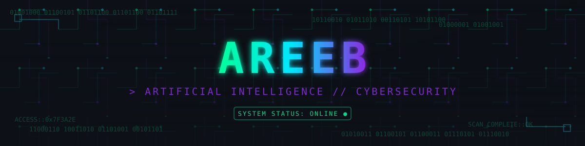

<div align="center">




<br/>

[](https://areeb-1357.github.io/)
&nbsp;
[](https://github.com/Areeb-1357)
&nbsp;

&nbsp;


</div>


<table align="center">
<tr>
<td width="50%" valign="top">

### `$ cat identity.cfg`

```yaml
role: "aspiring developer"
based_in: "India"
languages: ["Python", "HTML", "CSS", "JavaScript"]
interest_vectors:
  - "artificial intelligence"
  - "cybersecurity fundamentals"
  - "clean, readable systems"

learning_protocol: >
  build first, break it, understand deeply,
  refine later — loop forever

principles:
  - "readable code > clever code"
  - "ship something small every week"
  - "the portfolio is the source of truth"

session:
  status: "compiling_ideas"
  mindset: "curious.exe"
```

</td>
<td width="50%" valign="top">

### `$ whoami --verbose`

```
┌──────────────────────────────┐
│  USER      : areeb            │
│  ROLE      : dev_in_training  │
│  CLEARANCE : level_1          │
│  FOCUS     : ai / security    │
│  UPTIME    : still_learning   │
│  STATUS    : ● ONLINE         │
└──────────────────────────────┘

> encryption ......... enabled
> curiosity_module .... maxed
> shipping_streak ..... active
```

</td>
</tr>
</table>


<div align="center">

### 🛠️ `stack --list`


<br/><br/>

### 📊 `stats.exe --deep-scan`


<br/>

### 🏆 `trophy --unlock --rare`


</div>


<div align="center">

### 📡 `connect --with=me`

[](https://areeb-1357.github.io/)
[](https://github.com/Areeb-1357)

<br/>


</div>
